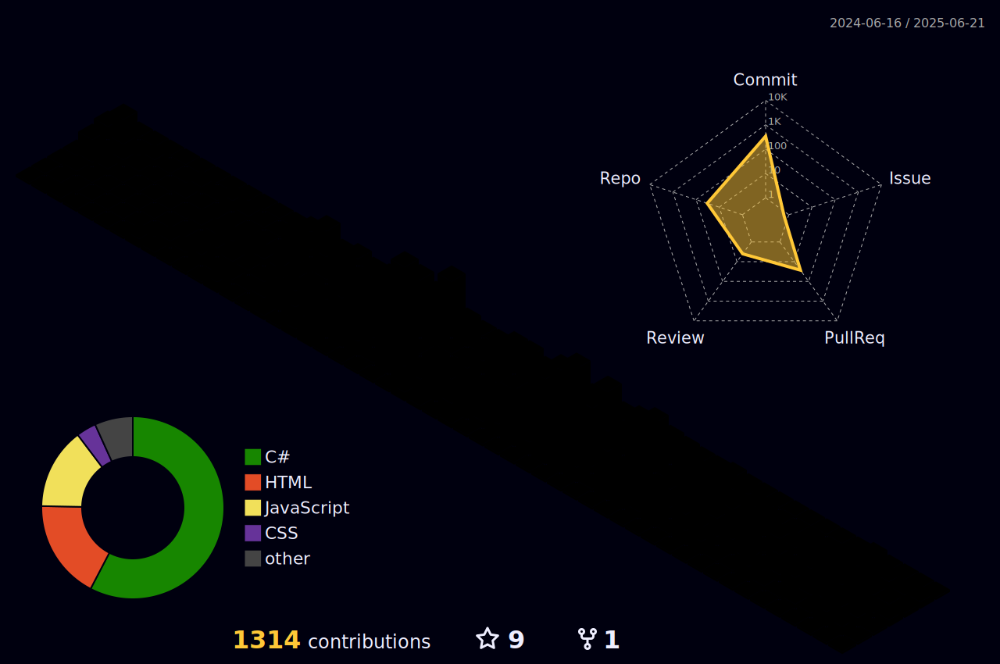

    <h1>Hello! I am Camila Lima</h1>

<h2 align="left">
    
    A little about me:</h2>
    <ul>
        <li>I'm a passionate and results-driven .NET Developer with hands-on experience in web technologies including HTML, CSS, Razor Pages, and JavaScript. My expertise extends to both front-end and back-end development, with strong skills in C#.NET, VB.NET, and PowerBuilder.</li>
        <li>Outside of coding, I enjoy going to the gym and dancing. I believe a healthy body and mind are key to professional success.</li>
    </ul>
<h2 align="left">
  
  Technical Skills
</h2>

<ul>
    <li><strong>Programming:</strong> C#, VB.NET, PowerBuilder</li>
    <li><strong>Web:</strong> HTML, CSS, JavaScript, Razor Pages</li>
    <li><strong>Databases:</strong> MySQL, SQL Server, PostgreSQL</li>
</ul>

<h2 align="left">🚀 What I Do</h2>
<ul>
    <li>Design and build robust, scalable web applications</li>
    <li>Develop and optimize SQL queries for complex business requirements</li>
    <li>Collaborate in agile teams to deliver high-quality, maintainable code</li>
</ul>
    
<h2 align="left">🌱 What I'm Looking For</h2>
I'm currently seeking new opportunities as a developer where I can contribute my skills, learn from others, and grow professionally.

<h2 align="left">Languages and Technologies I use most:</h2>

  
 
    <kbd>
      <kbd>Back-end</kbd>
        
      
       
      
    </kbd>
    <kbd>
      <kbd>Database</kbd>
        
      
      
      
      
    </kbd>
    <kbd>
      <kbd>Front-end</kbd>
        
      
      
      
      
      
    </kbd>
    <kbd>
      <kbd>Version Control</kbd>
        
      
       
       
    </kbd>
    <kbd>
      <kbd>Environments</kbd>
            
      
      
    </kbd>
  

<h2 align="left"> Algumas métricas: </h2>

  
 
  |  |  |  
 | ----------- | ----------- |
 
   

      
<picture align="center">
  <source media="(prefers-color-scheme: dark)" srcset="https://raw.githubusercontent.com/DanielleBassetto/DanielleBassetto/output/github-contribution-grid-snake-dark.svg">
  <source media="(prefers-color-scheme: light)" srcset="https://raw.githubusercontent.com/DanielleBassetto/DanielleBassetto/output/github-contribution-grid-snake-dark.svg">
  
</picture>

